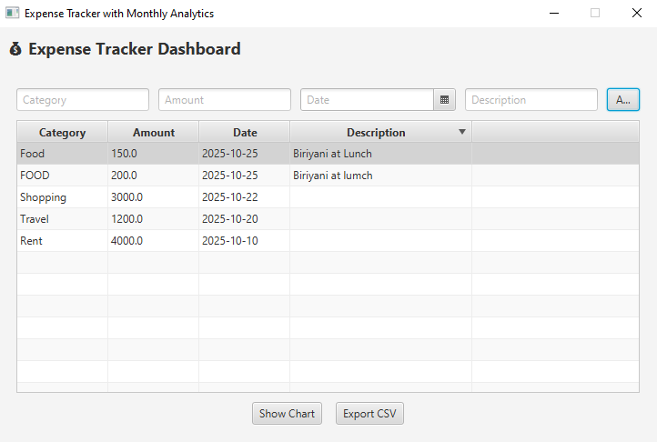
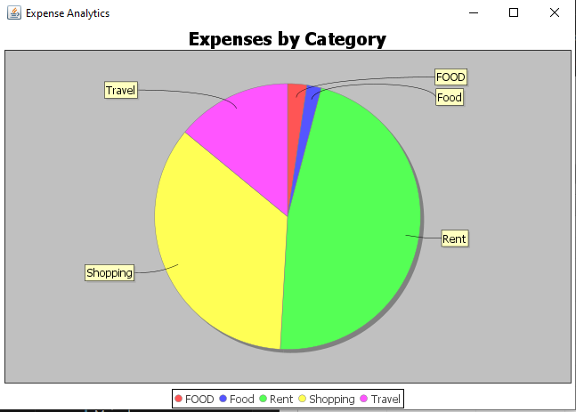

# Expense Tracker (JavaFX + SQLite)

## Overview
The **Expense Tracker** is a Java-based desktop application that allows users to record, manage, and analyze their daily expenses.  
The application provides a user-friendly interface built with **JavaFX**, where users can enter details such as **category, amount, date, and description** for each expense.  

All expenses are stored in a local **SQLite database** and also saved to a **CSV file** for backup and data portability.

This project demonstrates how to integrate **JavaFX (for the front-end)** with **SQLite (for persistent data storage)** and includes **data visualization through charts**.  
It is an ideal project for students and developers who want to learn about desktop application development, database integration, and file handling in Java.

---

## Features

### 1. Add Expense Entries
- Users can input details including **category**, **amount**, **date**, and **description**.  
- Data is saved in both the **database** and a **CSV file**.

### 2. View Expenses in a Table
- A dynamic **TableView** displays all expenses with columns for category, amount, date, and description.

### 3. Database Integration
- Uses **SQLite** as a lightweight, file-based database to store expense data.  
- Automatically creates the table if it does not exist.

### 4. CSV Backup
- Every entry added to the database is also written to a **CSV file**.  
- This allows users to open their data in spreadsheet software such as **Excel**.

### 5. Chart Visualization
- Displays expense data in a graphical format (**Pie Chart** or **Bar Chart**) to help analyze spending habits.

### 6. Error Handling
- Includes exception handling for invalid input and database connectivity issues.

### 7. Modular Code Design
- Implements a structured approach separating **UI**, **database logic**, and **controller functions**.

---

## Technologies Used

| Component | Technology |
|------------|-------------|
| Programming Language | Java |
| GUI Framework | JavaFX |
| Database | SQLite |
| Database Driver | SQLite JDBC |
| File Handling | CSV file I/O |
| IDE Used | Visual Studio Code or IntelliJ IDEA |
| JDK Version | Java 17 or higher |

---

## Setup Instructions

### Prerequisites
1. **Java Development Kit (JDK 17 or above)**  
   - Make sure Java is installed and configured in your system environment variables.

2. **SQLite JDBC Library**  
   - Download `sqlite-jdbc.jar` and place it in the `lib` folder of your project.

3. **JavaFX SDK**  
   - Download the latest JavaFX SDK from [https://openjfx.io](https://openjfx.io)  
   - Extract it to a known directory.

---

## How the Application Works

1. When the user runs the application, a **JavaFX window** opens displaying input fields for expense details.  
2. The user enters the **category, amount, date, and description**, then clicks the **Add Expense** button.  
3. The entered data is:
   - Saved to the **SQLite database** using JDBC.  
   - Appended to a **CSV file** as a backup.  
4. The **TableView** updates automatically to show the new entry.  
5. A **Chart** is updated dynamically to represent the distribution of expenses by category.  
6. The database ensures **data persistence**, so even after closing the app, the expense records remain available.

---

## Screenshots

### Expense Table View

### Expense Chart Visualization

---

## Learning Outcomes
Through this project, you will learn how to:
- Build desktop GUI applications using **JavaFX**.  
- Connect and interact with a **SQLite** database using **JDBC**.  
- Handle **file I/O operations** in Java.  
- Organize projects following **MVC (Model-View-Controller)** architecture.  
- Implement **data visualization** using JavaFX charts.  
- Manage **error handling** and debugging techniques for database connectivity.

---

## Conclusion
The **Expense Tracker** project provides a complete and practical example of building a desktop application with real-world functionality using **JavaFX** and **SQLite**.  
It demonstrates how to integrate GUI, database management, and data visualization in a cohesive application.  

This project is particularly helpful for **beginners** and **intermediate Java developers** looking to strengthen their understanding of full-stack desktop application development.
